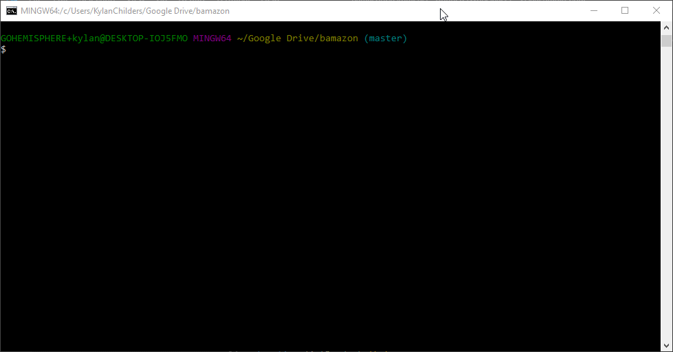

# bamazon
A node application that utilizes the node packages mysql to reference a local mysql database and inquirer to grab user input. The application allows a customer to select an item to purchase based on the entries in the database, and will either allow them to be successful in placing a purchase and decrementing the stock by the amount purchased, or notify them that there is not enough stock available

